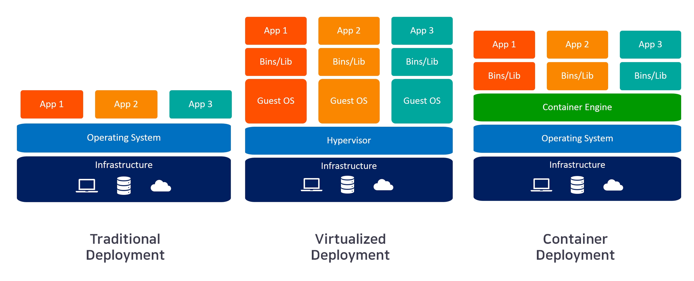
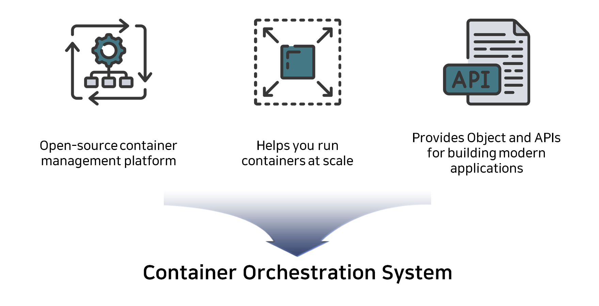

# What is Kubernetes

## 개발 환경에 변화

- 전통적인 배포 : 리소스 할당 문제 (한 서버에 리소스 전부를 차지하는 애플리케이션 인스턴스가 있을 수 있고, 결과적으로는 다른 애플리케이션의 성능이 저하될 수 있음), 리소스 유휴 문제 (한 서버에 한 애플리케이션이 있을 경우, 낭비되는 리소스가 발생)
- 가상화 배포 : 단일 서버의 CPU에서 여러 VM을 실행. 가상화를 사용하면 물리 서버에서 리소스를 보다 효율적으로 활용할 수 있으며, 쉽게 애플리케이션을 추가하거나 업데이트할 수 있고 하드웨어 비용을 절감할 수 있어 더 나은 확장성을 제공. 각 VM은 가상화된 하드웨어 상에서 자체 운영체제를 포함한 모든 구성 요소를 실행하는 하나의 완전한 머신 (OS로 인해 무거움).
- 컨테이너 개발 : 컨테이너는 VM과 유사하지만 격리 속성을 완화하여 애플리케이션 간에 운영체제(OS)를 공유 (이로 인해 컨테이너는 가벼움).

## Container 개발 특징
* 기민한 애플리케이션 생성과 배포: VM 이미지를 사용하는 것에 비해 컨테이너 이미지 생성이 보다 쉽고 효율적이다.
지속적인 개발, 통합 및 배포: 안정적이고 주기적으로 컨테이너 이미지를 빌드해서 배포할 수 있고 (이미지의 불변성 덕에) 빠르고 효율적으로 롤백할 수 있다.
* 개발과 운영의 관심사 분리: 배포 시점이 아닌 빌드/릴리스 시점에 애플리케이션 컨테이너 이미지를 만들기 때문에, 애플리케이션이 인프라스트럭처에서 분리된다.
* observability: OS 수준의 정보와 메트릭에 머무르지 않고, 애플리케이션의 헬스와 그 밖의 시그널을 볼 수 있다.
개발, 테스팅 및 운영 환경에 걸친 일관성: 랩탑에서도 클라우드에서와 동일하게 구동된다.
* 클라우드 및 OS 배포판 간 이식성: Ubuntu, RHEL, CoreOS, 온-프레미스, 주요 퍼블릭 클라우드와 어디에서든 구동된다.
애플리케이션 중심 관리: 가상 하드웨어 상에서 OS를 실행하는 수준에서 논리적인 리소스를 사용하는 OS 상에서 애플리케이션을 실행하는 수준으로 추상화 수준이 높아진다.
* 느슨하게 커플되고, 분산되고, 유연하며, 자유로운 마이크로서비스: 애플리케이션은 단일 목적의 머신에서 모놀리식 스택으로 구동되지 않고 보다 작고 독립적인 단위로 쪼개져서 동적으로 배포되고 관리될 수 있다.
* 리소스 격리: 애플리케이션 성능을 예측할 수 있다.
* 리소스 사용량: 고효율 고집적.

## What is Kubernetes

* 오픈 소스 컨테이너 관리 플랫폼
* 실행중인 컨테이너 확장 기능
* 모던 Application을 구축에 필요한 Object와 API 제공

> --> Container Orchestration!!

## Container Orchestration

> 다수의 컨테이너를 다수의 시스템에서 각각 목적에 따라 배포/복제/장애복구 등 총괄적으로 관리

### Orchestration 일반적 기능
- Scheduling
- Auto Scaliing
- Failover
- Logging & Monitoring
- Service Discovery & Load Balancing
- Automated Rollbacks
- Self Healing

### Container Orchestration Tool
- Kubernetes **
- Docker Swarm
- Marathon
- Nomad
- AWS ECS
- Azure Container Instance / Azure Service Fabric

## Kubernetes로 할 수 있는 것

- Service Discovery & Load Balancing
- Storage Orchestration
- Auto Rollouts & Auto Rollbacks
- Automatic Bin Packing
- Self-healing
- Secret & Configuration Management

