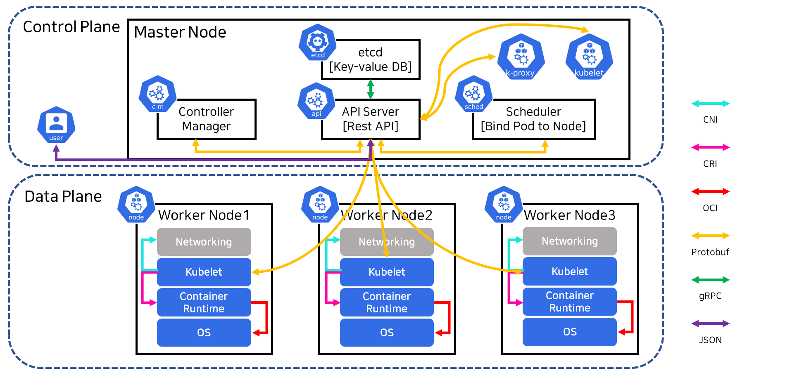

# Kubernetes Architecture

* CNI : Container Network Interface
* CRI : Container Runtime Interface
* Protobuf : Protocol Buffers | 구조화된 데이터를 직렬화하는 방식
* gRPC : google Remote Procedure Call

- Container Runtime | containerd, cri-o
- CNI | calico, Flannel