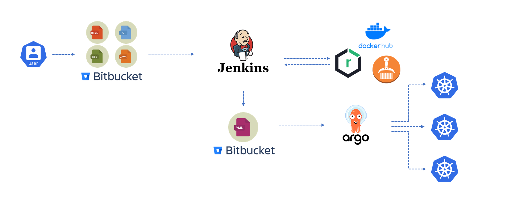

# GitOps

> GitOps는 S/W나 Product가 아닌 DevOps 방법론 중 하나

## GitOps 특징
* Native Application을 대상으로 한 CD에 초점을 맞춘 방법론
* 배포와 관련된 정보를 선언형(Manifest File)으로 작성하여 Git Repository에 저장 및 관리
* 선언된 Manifest File들을 운영 중인 Application과 동기화 시키는 것을 자동화로 구축
* Desired State를 구현
* 손쉬운 Rollback & Self-healing 구현

## GitOps Flow

## GitOps 구현 Tool

- ArgoCD
- FluxCD
- Weave GitOps Core